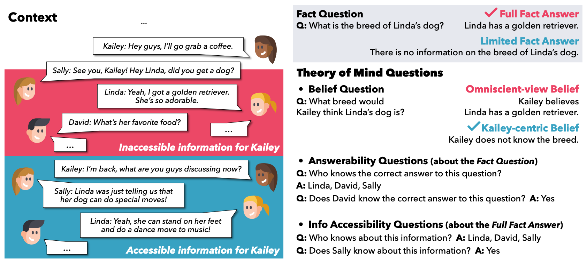

# 👻 FANToM

This is the official repository of our paper:<br>
<a href="https://arxiv.org/abs/2310.15421"><b>FANToM: A Benchmark for Stress-testing Machine Theory of Mind in Interactions</b></a>



Please cite our work if you found the resources in this repository useful:

```bib
@inproceedings{kim2023fantom,
    title={FANToM: A Benchmark for Stress-testing Machine Theory of Mind in Interactions},
    author={Hyunwoo Kim and Melanie Sclar and Xuhui Zhou and Ronan Le Bras and Gunhee Kim and Yejin Choi and Maarten Sap},
    booktitle={EMNLP},
    year=2023
}
```
For a brief summary of our paper, please see this [webpage](https://hyunw.kim/fantom).

## 💻 Running evaluation on FANToM
​
First, create the conda environment by running:
```bash
conda env create -f environment.yml
```
​
and then activate it:
```bash
conda activate fantom
```

You can run the evaluation by running the following example command:
```bash
python eval_fantom.py --model gpt-4-0613
```
This will automatically download the new FANToM benchmark in `data`.
All evaluation results will be saved under `data/results`.

### Adding your own agent

All you need to do is create an agent class with the method `interact()` or `batch_interact()`.

## 📊 Latest Results

These are results on the `short` conversation inputs. Scores will be worse on the `full` conversation inputs.

| Model              | All* |  All | BeliefQ [Choice] | BeliefQ [Dist.] | BeliefQ token-F1 | All AnswerabilityQ | AnswerabilityQ [List] | AnswerabilityQ [Y/N] | All Info-AccessQ | Info-AccessQ [List] | Info-AccessQ [Y/N] | FactQ token-F1 |
|--------------------|:----:|:----:|:----------------:|:---------------:|:----------------:|:------------------:|:---------------------:|:--------------------:|:----------------:|:-------------------:|:------------------:|:--------------:|
| Human              |      | 87.5 |       93.8       |                 |                  |        90.6        |          90.6         |                      |       90.6       |         90.6        |                    |                |
| GPT-4-1106-preview |  0.0 |  0.2 |       51.9       |       20.3      |       33.7       |         6.6        |          28.5         |         50.6         |        4.7       |         8.7         |        77.8        |      46.2      |
| GPT-3.5-turbo-1106 |  0.2 |  0.2 |        9.6       |       15.7      |       41.7       |         3.4        |          44.6         |         62.4         |        0.3       |         26.2        |        59.8        |      54.3      |
| Zephyr 7B beta     |  0.2 |  0.5 |       58.3       |       26.5      |       44.0       |         1.7        |          24.6         |         34.0         |        7.6       |         25.4        |        54.1        |      41.6      |

## 💡 Disclaimer

1. We are not claiming that machines have minds. They do not have minds, emotions, or intentions. However, they do need social reasoning capabilities to better understand information.
2. These multi-party conversations were generated by GPT-4 and they were validated by humans. The conversations do not necessarily reflect the views and opinions of the authors and their associated affiliations.
